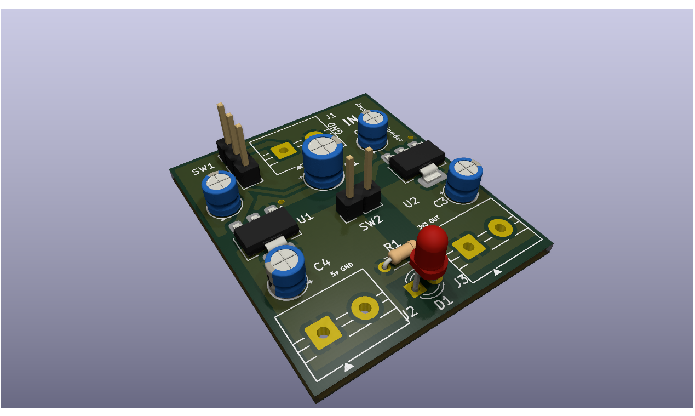
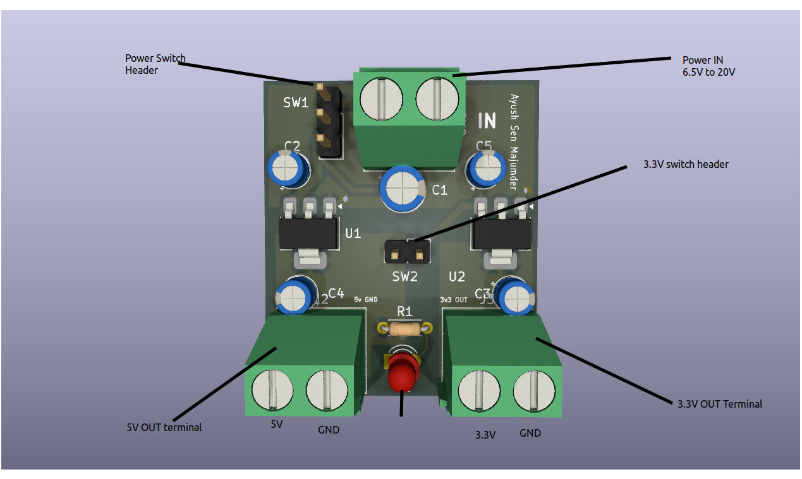

# Simple Voltage Regulator Board

This is a simple voltage regulator board, which takes in between 6.5V and upto 20V input, and outputs both 5V and 3.3V, with a maximum current output of 1A. This project uses the well-known AMS1117 step-down linear voltage regulators, which are Low Droput Regulators, meaning the voltage drop across them is than normal linear regulators. Here there are 2 of them, 1 of which steps down (decreases) 6.5V-20V to 5V, and the other one which steps down 5V from the previous LDO, into 3.3V. 

# How to use the board: 

Here is a 3D model of the board: 

You will see 3 screw terminal blocks; 1 on the top side, and 2 on the bottom. The one on top, labelled IN is the input block. Here, you should screw in the input wires, which can be from a a battery or any power source up to 20V. Be mindful of the polarity! You can see GND is labelled next to the ground input. 

Next, to turn the board on, add a short jumper to the 3 header pins next to the input. Short/connect the top 2 pins to connect the board to power. To disconnect, move the jumper to the bottom 2 pins. After turning it on, you will see the red LED glow. This means the 5V output and the board is turned on. You can now connect the 5V output (on the bottom left side) to anything u want to power, but once again be mindful of polarity. It is labelled on the board. 

To turn on the 3.3V output, use a short header to connect the 2 header pins in the center of the board. Now the 3.3V output is turned on (bottom right side of board) and you can connect it to anything that runs on 3.3V, such as microcontrollers and development boards. 

# Why I made this board

I found myself struggling to power my electronic components, such as motors with an arduino. You cannot run them directly with the 5V output of the arduino due to current cosntraints, as well as you risk frying the arduino. In such cases I struggled to power them seperately with a quality, high current power source. Normal batteries and Li-Ion rechargable batteries do not have the required voltage either, and running from USB power is not ideal. Hence I developed this regulator board, so a stable and proper 5V and 3.3V power source can be used for projects.

# Schematics 

# PCB design 

KiCAD editor:

3D model-

Front side: 

Back side:

All Schematics and PCB file (including gerber zip) is available in the PCB files directory.

# Bill of materials

| Item | Qty. | Price (INR) | Ext. (INR) | Link |
| :--- | :--- | :--- | :--- | :--- |
| AMS1117-3.3V, 1A, SOT-223 Voltage Regulator IC (Pack of 5) | 2 | 9.00 | 18.00 | [Link](https://robu.in/product/ams1117-3-3v-1a-sot-223-voltage-regulator-ic-pack-of-5-ics/) |
| AMS1117-5.0V, 1A, SOT-223 Voltage Regulator IC (Pack of 5) | 2 | 6.00 | 12.00 | [Link](https://robu.in/product/ams1117-5-0v-1a-sot-223-voltage-regulator-ic-pack-of-5-ics/) |
| 100uF 25V Electrolytic Capacitor (Pack of 10) | 3 | 4.18 | 12.54 | [Link](https://robu.in/product/100uf-25v-electrolytic-capacitor-pack-of-10/) |
| 3mm Red DIP LED (Pack of 50) | 16 | 0.63 | 10.08 | [Link](https://robu.in/product/3mm-red-dip-led-pack-of-50/) |
| HY1H100M050110CD288-HYNCDZ-10uF 50V Aluminum Electrolytic | 16 | 0.65 | 10.40 | [Link](https://robu.in/product/hy1h100m050110cd288-hyncdz-10uf-50v-1-82%cf%89100khz-%c2%b120-120ma100khz-plugind5xl11mm-aluminum-electrolytic-capacitors-leaded-rohs/) |
| ERS1HM220D12OT-AISHI -22uF 50V Aluminum Electrolytic | 5 | 2.00 | 10.00 | [Link](https://robu.in/product/ers1hm220d12ot-aishi-22uf-50v-%c2%b120-plugind5xl12mm-aluminum-electrolytic-capacitors-leaded-rohs/) |
| 2 Pin 5.08mm Pitch Plug-in Screw Terminal Block | 3 | 7.00 | 21.00 | [Link](https://robu.in/product/kf301-2-pin-5-08mm-pitch-plug-in-screw-terminal-block-connector-pack-of-5/) |
| 100nf 50v Disc Capacitor | 10 | 1.00 | 10.00 | [Link](https://robu.in/product/100nf-50v-disc-capacitor/) |
| 1k Ohm 0.25W Metal Film Resistor (Pack of 100) | 35 | 0.29 | 10.15 | [Link](https://robu.in/product/1k-ohm-0-25w-metal-film-resistor-pack-of-100/) |
| PCB Fabrication | 5 | 159 | 943 (799 + 18% tax) | [Link](lioncircuits.com) |

Total: 1057.17 INR  (114.17 INR for components)
       
       $11.51 USD ($1.24 USD for components)

Also in .csv format, in BOM.csv 

